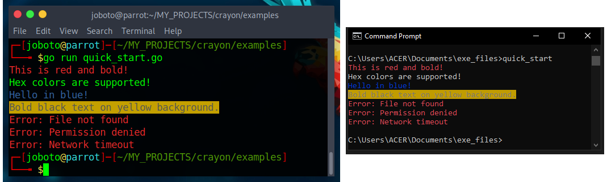

# Inkstamp Examples


## Basic Colors

```go
package main

import "github.com/inkstamp/inkstamp"

func main() {
    // Named colors
    inkstamp.Parse("[fg=red]Red text[reset]").Println()
    inkstamp.Parse("[fg=green bg=black]Green on black[reset]").Println()

    // 256-color palette
    inkstamp.Parse("[fg=214]Orange[reset]").Println()

    //Hex colors
    inkstamp.Parse("[fg=#FF5733]Orange hex[reset]").Println()
    
    // RGB colors
    inkstamp.Parse("[fg=rgb(255,105,180)]Hot pink text[reset]").Println()
}
```

---

## Styles
```go
package main

import "github.com/inkstamp/inkstamp"

func main() {

    // Styles
    inkstamp.Parse("[bold]Bold text[reset]").Println()
    inkstamp.Parse("[italic]Italic text[reset]").Println()
    inkstamp.Parse("[underline=single]Underlined text[reset]")
    inkstamp.Parse("[bold italic underline=single]All three[reset]")
    
    // Reset specific attributes
    inkstamp.Parse("[bold fg=blue]Blue bold text. [bold=reset]No longer bold, but still blue. [fg=reset]No color, but other styles remain[reset]").Println()
}
```
## Output



---

## Templates (Parse Once, Stamp Many Times)
```go
package main

import "github.com/inkstamp/inkstamp"

func main() {

    // Styles
    row := inkstamp.Parse("[fg=cyan][0:<20][fg=yellow][1:>10][reset]")

    row.Println("Alice", "admin")
    row.Println("Bob", "user")
    row.Println("Charlie", "guest")
}
```

---


## Padding & Alignment

```go
package main

import "github.com/inkstamp/inkstamp"

func main() {

    // Left align, width 20
    inkstamp.Parse("[0:<20]").Println("Left")

    // Right align, width 10
    inkstamp.Parse("[0:>10]").Println("Right")

    // Center align, width 30
    inkstamp.Parse("[0:^30]").Println("Centered")
}
```

## Custom Fill Characters

```go
package main

import "github.com/inkstamp/inkstamp"

func main() {

    // Dot leaders
    report := inkstamp.Parse("[0:<30:.][1:>10]")
    report.Println("Total Revenue", "$45,231")
    report.Println("Net Profit","$13,041")

    // Separator line
    sep = inkstamp.Parse("[0:^40:-]")
    sep.Println("")

    // Progress bar
    bar := inkstamp.Parse("[fg=green][0:<50:_][reset] [1]%%")
    bar.Println(strings.Repeat("#", 35), "70")
}
```


## Tables

```go
package main

import (
    "fmt"
    "strings"
    "github.com/inkstamp/inkstamp"
)

func main() {
    
    // Table with colored headers
    header := inkstamp.Parse("[bold fg=cyan][0:<15][1:>10][reset]")
    row := inkstamp.Parse("[0:<15][fg=yellow][1:>10][reset]")
    sep := inkstamp.Parse("[fg=cyan][0:^27:-][reset]")
    
    //headerTemp.Println(strings.Repeat("─", 40))
    sep.Println("")
    header.Println("NAME", "STATUS")
    sep.Println("")
    //headerTemp.Println(strings.Repeat("─", 40))
    
    row.Println("Alice", "admin")
    row.Println("Bob", "user")
    row.Println("Charlie", "guest")
    sep.Println("")

}
```

---


## CLI Help Menu

```go
package main

import "github.com/inkstamp/inkstamp"

  var(
  header = inkstamp.Parse("[bold fg=cyan][0:^40:=][reset]")
  command  = inkstamp.Parse("[fg=yellow][0:<25][fg=green][1][reset]")
  flag = inkstamp.Parse("[fg=yellow][0][reset], [fg=yellow][1:<20] [fg=green][2][reset]")
  )

func ShowHelp() {
    header.Println("")
    header.Println("MyApp Help")
    header.Println("")
    fmt.Println()
    
    header.Println("Commands")
    command.Println("start", "Start the application")
    command.Println("stop", "Stop the application")
    command.Println("status", "Check application status")
    command.Println()
    
    header.Println("Options")
    flag.Println("-h", "--help", "Show this help")
    flag.Println("-v", "--version", "Show version")
    flag.Println("-d", "--debug", "Enable debug mode")
}

func main(){
	ShowHelp()
}

```
## Output


---

## Log Formatter

```go
package main

import "github.com/inkstamp/inkstamp"

func main() {

    var (
        logTemp = inkstamp.Parse("[0] [fg=blue][1][reset]: [fg=yellow][2][reset]")
        temp = inkstamp.Parse("[[fg=red bold]Error[reset]]: [0][reset]")
    )
    
    // Different log levels
    logTemp.Println("[INFO]", "main", "Application started")
    logTemp.Println("[WARN]", "auth", "Token expiring soon")
    logTemp.Println("[ERROR]", "db", "Connection failed")

    
    
    // Reuse multiple times
    temp.Println("File not found")
    temp.Println("Permission denied")
    temp.Println("Network timeout")
}
```

---

## Color Toggling

```go
package main

import (
    "fmt"
    "os"
    "github.com/inkstamp/inkstamp"
)

func main() {
    // Inkstamp decides - colors on for TTY, off for piped output
    toggle := inkstamp.NewColorToggle()

    errorTemp := toggle.Parse("[fg=red]Error [0][reset]")
    
    errorTemp.Println("Operation failed")
    

    // Manual control
    forceOn := inkstamp.NewColorToggle(true)   // Always show colors
    forceOff := inkstamp.NewColorToggle(false)     // Never show colors
    
    
    // Use in CLI applications
    //Respect both --no-color flag and NO_COLOR environment variable
    noColorFlag = false
    for _, arg := range os.Args {
        if arg == "--no-color" {
            noColorFlag = true
            break
        }
    }
    useColor := !noColorFlag && os.Getenv("NO_COLOR") == ""
    appToggle := inkstamp.NewColorToggle(useColor)
    
    helpTemplate := appToggle.Parse("[bold fg=cyan][0][reset] [fg=green][1][reset]")
    helpTemplate.Println("Usage:", "myapp [options]")
}
```